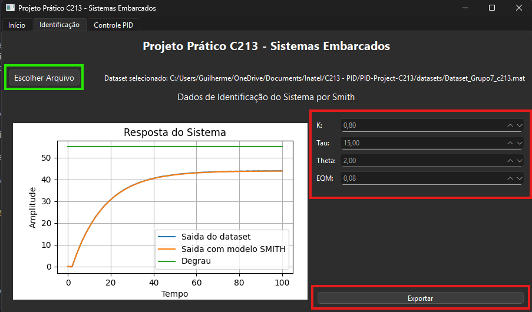
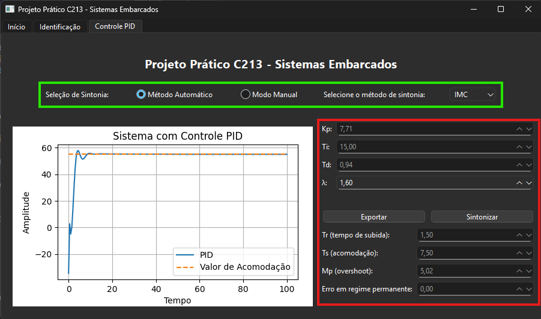

# Projeto de Controle - Sintonia PID

Este projeto tem como objetivo realizar a identificação e sintonia de um sistema de controle utilizando controladores PID. A interface permite carregar dados experimentais, identificar os parâmetros da planta com método de Smith, aplicar métodos de sintonia clássicos e analisar a resposta do sistema controlado.

## Sumário

- [1. Instalação](#1-instalação)
- [2. Como Usar](#2-como-usar)
  - [2.1 Executando o Projeto](#21-executando-o-projeto)
  - [2.2 Interface de Identificação](#22-interface-de-identificação)
  - [2.3 Interface de Controle PID](#23-interface-de-controle-pid)
- [3. Organização do Projeto](#3-organização-do-projeto)
- [4. Interface Gráfica (PySide6)](#4-interface-gráfica-pyside6)
- [5. Controllers e Orientação a Objetos](#5-controllers-e-orientação-a-objetos)
- [6. Widget de Plotagem](#6-widget-de-plotagem)
- [7. Fundamentos Matemáticos de Controle](#7-fundamentos-matemáticos-de-controle)
  - [7.1 Método de Identificação de Smith](#71-método-de-identificação-de-smith)
  - [7.2 Métodos de Sintonia PID](#72-métodos-de-sintonia-pid)

---

## 1. Instalação

Para instalar as dependências necessárias do projeto, execute o seguinte comando no terminal:

```bash
pip install -r requirements.txt
```

### Dependências do Projeto

- **PySide6**: Interface gráfica baseada em Qt
- **matplotlib**: Plotagem de gráficos e visualização
- **numpy**: Computação numérica e arrays
- **scipy**: Funções científicas (carregamento de dados .mat)
- **control**: Biblioteca de sistemas de controle

---

## 2. Como Usar

### 2.1 Executando o Projeto

Para iniciar a aplicação, execute o arquivo principal:

```bash
python main.py
```

A interface gráfica será aberta com três abas:
- **Início**: Informações sobre o projeto e integrantes
- **Identificação**: Carregamento de dados e identificação de parâmetros
- **Controle PID**: Sintonia e análise de controladores PID

### 2.2 Interface de Identificação

1. **Carregar Dataset**: Clique em "Escolher Arquivo" para selecionar um arquivo .mat contendo os dados experimentais
2. **Identificação Automática**: O sistema automaticamente identifica os parâmetros K, Tau e Theta usando o método de Smith
3. **Visualização**: O gráfico mostra a saída do dataset, a saída simulada com o modelo identificado e o sinal de entrada
4. **Exportação**: Use o botão "Exportar" para salvar o gráfico em formato de imagem



### 2.3 Interface de Controle PID

1. **Seleção do Método**: 
   - **Automático**: Escolha entre os métodos IMC, ITAE, ZNMA, CHR, CHR_20 ou CeC
   - **Manual**: Insira manualmente os parâmetros Kp, Ti e Td

2. **Configuração de Parâmetros**:
   - Para o método IMC, ajuste também o parâmetro λ (lambda)
   - Os demais métodos calculam automaticamente todos os parâmetros

3. **Sintonia**: Clique em "Sintonizar" para calcular e visualizar a resposta do sistema controlado

4. **Análise de Performance**: O sistema calcula automaticamente:
   - Tr (tempo de subida)
   - Ts (tempo de acomodação)
   - Mp (overshoot máximo)
   - Erro em regime permanente



---

## 3. Organização do Projeto

A estrutura do projeto segue uma arquitetura modular organizada da seguinte forma:

```
PID-Project-C213/
├── main.py                          # Arquivo principal de execução
├── requirements.txt                 # Dependências do projeto
├── README.md                        # Documentação do projeto
├── controllers/                     # Lógica de controle
│   ├── identificacao_controller.py  # Controller de identificação
│   └── pid_controller.py           # Controller de PID
├── core/                           # Algoritmos matemáticos
│   ├── imc.py                      # Método IMC
│   ├── itae.py                     # Método ITAE
│   ├── znma.py                     # Método Ziegler-Nichols
│   ├── chr.py                      # Método CHR
│   └── cec.py                      # Método Cohen-Coon
└── ui/                             # Interface gráfica
    ├── main_window.py              # Janela principal
    ├── pages/                      # Páginas da aplicação
    │   ├── page_inicio.py          # Página inicial
    │   ├── page_identificacao.py   # Página de identificação
    │   └── page_controll_pid.py    # Página de controle PID
    └── widgets/                    # Componentes reutilizáveis
        └── plot_widget.py          # Widget de plotagem

```

---

## 4. Interface Gráfica (PySide6)

A interface gráfica foi desenvolvida utilizando o **PySide6**, a versão oficial do Qt para Python. A arquitetura segue os seguintes princípios:

### 4.1 Estrutura da Interface

- **MainWindow**: Janela principal que gerencia as abas do sistema
- **QTabWidget**: Componente que organiza as diferentes funcionalidades em abas
- **Pages**: Classes específicas para cada funcionalidade (Início, Identificação, Controle)
- **Widgets**: Componentes reutilizáveis como o PlotWidget

### 4.2 Padrões de Design

**Separação de Responsabilidades**: Cada página é uma classe independente que herda de `QWidget`

**Injeção de Dependência**: Os controllers são passados como parâmetros para as páginas que os utilizam

**Layout Responsivo**: Utilização de layouts flexíveis (`QVBoxLayout`, `QHBoxLayout`) que se adaptam ao redimensionamento

### 4.3 Componentes Principais

- **QPushButton**: Botões de ação (Carregar arquivo, Sintonizar, Exportar)
- **QDoubleSpinBox**: Campos numéricos para parâmetros e resultados
- **QComboBox**: Seleção de métodos de sintonia
- **QRadioButton**: Seleção entre modo automático e manual
- **QFormLayout**: Organização de formulários de entrada
- **QFileDialog**: Diálogo para seleção de arquivos

---

## 5. Controllers e Orientação a Objetos

A arquitetura do projeto utiliza o padrão **MVC (Model-View-Controller)** para separar a lógica de negócio da interface gráfica.

### 5.1 IdentificacaoController

```python
class IdentificacaoController:
    def __init__(self):
        self.data = None
        self.k = 0
        self.tau = 0  
        self.theta = 0
        self.eqm = 0
```

**Responsabilidades:**
- Carregamento de dados experimentais (.mat)
- Identificação de parâmetros usando o método de Smith
- Simulação do sistema identificado
- Cálculo do erro quadrático médio (EQM)

### 5.2 PIDController

```python
class PIDController:
    def __init__(self):
        self.k = 0
        self.tau = 0
        self.theta = 0
        self.tempo = np.array([])
        self.entrada = np.array([])
```

**Responsabilidades:**
- Sintonia automática usando diferentes métodos
- Sintonia manual com parâmetros definidos pelo usuário
- Cálculo de métricas de desempenho (Tr, Ts, Mp, Ess)
- Simulação da resposta em malha fechada

### 5.3 Vantagens da Orientação a Objetos

**Encapsulamento**: Cada método de sintonia é implementado como uma classe estática separada

**Polimorfismo**: Todos os métodos implementam a mesma interface (kp, ti, td)

**Reutilização**: Os algoritmos do core podem ser facilmente reutilizados

**Manutenibilidade**: Adicionar novos métodos requer apenas criar uma nova classe no core

**Exemplo de Implementação**:
```python
# Todos os métodos seguem o mesmo padrão
if method == 'IMC':
    kp = IMC.kp(self.k, self.theta, self.tau, lamb)
    ti = IMC.ti(self.theta, self.tau)
    td = IMC.td(self.theta, self.tau)
elif method == 'ITAE':
    kp = ITAE.kp(self.k, self.theta, self.tau)
    ti = ITAE.ti(self.theta, self.tau) 
    td = ITAE.td(self.theta, self.tau)
```

---

## 6. Widget de Plotagem

O `PlotWidget` é um componente personalizado que integra **matplotlib** com **PySide6** para visualização de dados.

### 6.1 Características Principais

**Integração Qt + Matplotlib**: Utiliza `FigureCanvasQTAgg` para embed do matplotlib no Qt

**Curvas Dinâmicas**: Suporte a múltiplas curvas com diferentes estilos e labels

**Atualização em Tempo Real**: Método `update_curves()` para redesenhar gráficos

**Grid e Legendas**: Formatação automática com grid e legendas

### 6.2 Classe Curve

```python
class Curve:
    def __init__(self, x_axis, y_axis, label, params=''):
        self.x_axis = x_axis    # Dados do eixo X
        self.y_axis = y_axis    # Dados do eixo Y  
        self.label = label      # Rótulo da curva
        self.params = params    # Parâmetros de estilo
```

### 6.3 Funcionalidades de Exportação

**Alta Resolução**: Exportação com DPI=800 para qualidade profissional

**Configuração Automática**: Ajuste automático de margens (`bbox_inches='tight'`)

**Tratamento de Erros**: Sistema de notificação de sucesso/erro via `QMessageBox`

---

## 7. Fundamentos Matemáticos de Controle

### 7.1 Método de Identificação de Smith

O método de Smith é utilizado para identificar sistemas de primeira ordem com atraso de transporte:

**Modelo do Sistema:**
```
G(s) = K * e^(-θs) / (τs + 1)
```

**Parâmetros Identificados:**
- **K (Ganho Estático)**: `K = (y_final - y_inicial) / u_entrada`
- **Tempos Característicos**: 
  - t₁ = tempo para atingir 28.3% da resposta final
  - t₂ = tempo para atingir 63.2% da resposta final
- **τ (Constante de Tempo)**: `τ = 1.5 * (t₂ - t₁)`  
- **θ (Atraso de Transporte)**: `θ = t₂ - τ`

### 7.2 Métodos de Sintonia PID

O controlador PID implementado tem a forma:

```
C(s) = Kp * (1 + 1/(Ti*s) + Td*s)
```

#### 7.2.1 Método IMC (Internal Model Control)

**Parâmetros:**
- `Kp = (2τ + θ) / (K(2λ + θ))`
- `Ti = τ + θ/2`
- `Td = (τθ) / (2τ + θ)`

**Restrição:** λ ≥ 0.8θ (para estabilidade)

#### 7.2.2 Método ITAE (Integral Time Absolute Error)

**Parâmetros com constantes otimizadas:**
- `Kp = (0.965/K) * (θ/τ)^(-0.85)`
- `Ti = τ / (0.796 - 0.147 * (θ/τ))`
- `Td = τ * 0.308 * (θ/τ)^0.929`

#### 7.2.3 Método Ziegler-Nichols Malha Aberta (ZNMA)

**Parâmetros clássicos:**
- `Kp = (1.2τ) / (Kθ)`
- `Ti = 2θ`
- `Td = θ/2`

#### 7.2.4 Método CHR (Chien-Hrones-Reswick)

**CHR sem overshoot:**
- `Kp = (0.6τ) / (Kθ)`
- `Ti = τ`
- `Td = θ/2`

**CHR com 20% overshoot:**
- `Kp = (0.95τ) / (Kθ)`
- `Ti = 1.357τ`
- `Td = 0.473θ`

#### 7.2.5 Método Cohen-Coon (CeC)

**Parâmetros:**
- `Kp = (τ/(Kθ)) * ((16τ + 3θ)/(12τ))`
- `Ti = θ * ((32 + 6θ/τ)/(13 + 8θ/τ))`
- `Td = (4θ)/(11 + 2θ/τ)`

### 7.3 Métricas de Desempenho

**Tempo de Subida (Tr)**: Tempo para ir de 10% a 90% do valor final

**Tempo de Acomodação (Ts)**: Tempo para entrar e permanecer na faixa de ±2% do valor final

**Overshoot Máximo (Mp)**: `Mp = ((valor_máximo - valor_final) / valor_final) * 100%`

**Erro em Regime Permanente (Ess)**: `Ess = valor_referência - valor_final`

---

## Integrantes do Projeto

- **Eduardo Augusto**
- **Guilherme Brito** 
- **João Gabriel**

---

*Projeto desenvolvido para a disciplina C213 - Sistemas Embarcados do Instituto Nacional de Telecomunicações (Inatel)*